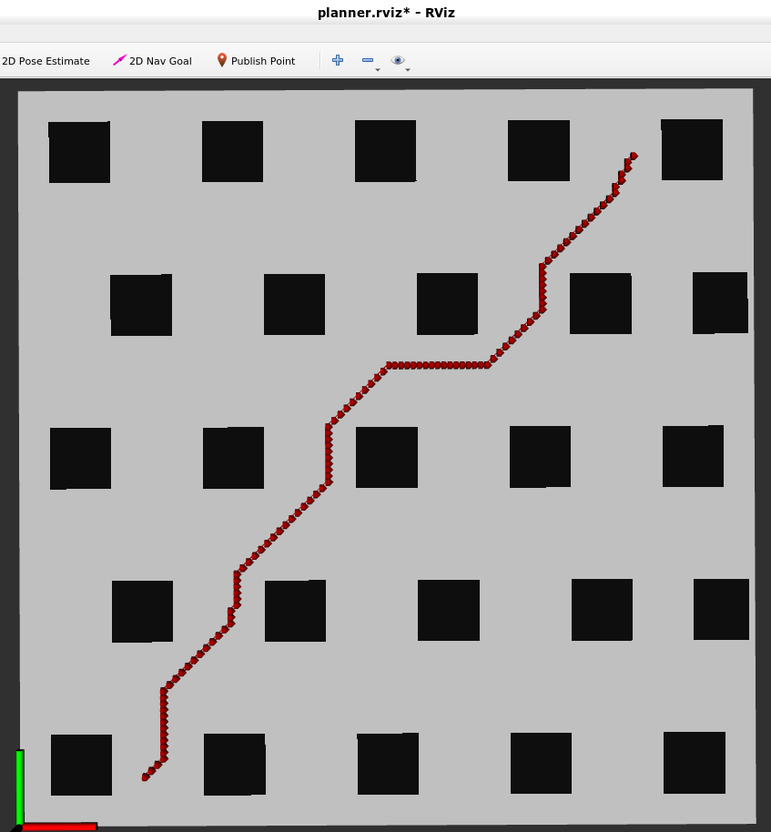

## Objectives
* To implement autonomous navigation in unknown environment, given the desired goal.

## Path Planning
#### A* 
A*  | A* with collision cost 
-------------------|---------------------

#### A* planner integrated with RVIZ GUI

## On-going Work
* Developing mapping module.
* Integrating px4 offboard mode + mavros to track the trajectory generated by planners.

### Acknowledgements
* I have used [Cubic Spline](https://github.com/AtsushiSakai/PythonRobotics/tree/master/PathPlanning/CubicSpline) module for generating spline through nodes.

